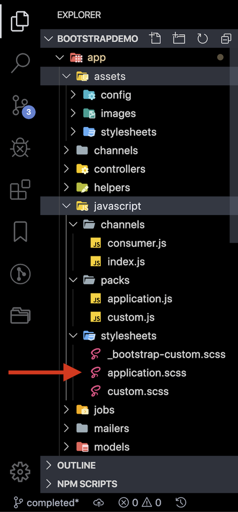

Hello neighbor. Since later versions of Rails have a slightly different behavior and folder structure, I figured it would be worth it to write a short guide on how to get Bootsrap installed into a _new_ Rails app. By new I simply mean you are installing Bootstrap in an app that is Rails 6.0 or later... or more specifically, a Rails app configured for Webpacker instead of Sprockets.

What is Webpacker? Whoa, you ask the best questions! It's why I love having you over♥️


[This article](https://prathamesh.tech/2019/08/26/understanding-webpacker-in-rails-6/) does a good job explaining what Webpacker is. I'll share a tiny bit with you here:
> webpacker is a gem which wraps webpack - the popular JavaScript tool used for managing and bundling JavaScript code - and provides helpers to use the webpack in our Rails applications. In simple words it provides Rails way of using webpack. Webpacker wraps webpack in a Ruby gem and provides helpers to use the output from Webpacker in the Rails application.

Really what I'd like you to take away is that Rails no longer uses [Sprockets](https://stackoverflow.com/questions/31828795/what-sprockets-mean-in-rails) by default. As a result the way we go about implementing Bootstrap is different. &nbsp;  A small example of how this affects us is directory (folder?) structuring. For example used to have a directory that was structured like this: &nbsp;  <span style="color: crimson;"> app/assets/javascript </span> . &nbsp; Nowadays, it is structured as follows: &nbsp; <span style="color: crimson;">app/javascript`</span>.

## Step 1: Gemfile
First things first, lets add the Bootstrap gem to our gemfile.

`gem 'bootstrap',  '~>4.3.1'`  _This will install a specific version of Bootstrap. So replace 4.3.1 with the latest version._ <br/>
or <br/>
`gem 'bootstrap'` &nbsp;  _This will default to the latest whenever bundle install is run_.

I'll leave it up to you to research which is the better route. For now, your Gemfile should look something like this:

```ruby
source 'https://rubygems.org'
git_source(:github) { |repo| "https://github.com/#{repo}.git" }

# <-- Added gems start-->

gem 'bootstrap'
# or `gem 'bootstrap',  '~>4.3.1'`

# <-- Added gems end --> 

ruby '2.6.1'
gem 'rails', '~> 6.0.1'
gem 'sqlite3', '~> 1.4'
gem 'puma', '~> 4.1'
gem 'sass-rails', '>= 6'
gem 'webpacker', '~> 4.0'
gem 'turbolinks', '~> 5'
gem 'jbuilder', '~> 2.7'
# Use Active Model has_secure_password
# gem 'bcrypt', '~> 3.1.7'
gem 'bootsnap', '>= 1.4.2', require: false

group :development, :test do
  gem 'byebug', platforms: [:mri, :mingw, :x64_mingw]
end

group :development do
  gem 'web-console', '>= 3.3.0'
  gem 'listen', '>= 3.0.5', '< 3.2'
  gem 'spring'
  gem 'spring-watcher-listen', '~> 2.0.0'
end

group :test do
  gem 'capybara', '>= 2.15'
  gem 'selenium-webdriver'
  gem 'webdrivers'
end

# Windows does not include zoneinfo files, so bundle the tzinfo-data gem
gem 'tzinfo-data', platforms: [:mingw, :mswin, :x64_mingw, :jruby]

```

<div style="border-style: solid; border-color: red; border-width: 1px; border-radius: 10px; padding: 20px">  If you are a Flatiron student, either / or wont make a huge difference in your world for your portfolio project. </div>
<br>

Anywho, after you've updated your Gemfile, run `bundle install` to get the Bootsrap gem installed. 
<hr>

## Step 2: Move sass to Webpack

2a: Create following folder app/javascript/packs/stylesheets/. <br/>
You can do so by running &nbsp; `mkdir app/javascript/packs/stylesheets/` &nbsp; from the command line. 

2b: In that stylesheets directory create an &nbsp; <span style="color: crimson;">application.scss</span> &nbsp; file. 
<br>



2c: Add `@import "bootstrap";` to your application.scss file. <br>

```js
// app/javascript/stylesheets/application.scss

@import "bootstrap";
```

2d: Also, let's change the reference link in application.html.erb file from <span style="color: crimson;">stylesheet\_link\_tag </span> &nbsp; to &nbsp; <span style="color: crimson;">stylesheet\_pack\_tag </span> &nbsp; When you are done, it should look something like this:

```html
<!DOCTYPE html>
<html>
  <head>
    <title>BootstrapDemo</title>
    <%= csrf_meta_tags %>
    <%= csp_meta_tag %>

    <%= stylesheet_pack_tag 'application', media: 'all', 'data-turbolinks-track': 'reload' %>
    <%= javascript_pack_tag 'application', 'data-turbolinks-track': 'reload' %>
  </head>

  <body>
    <%= yield %>
  </body>
</html>
```


## Step 3: [Yarn](https://engineering.fb.com/web/yarn-a-new-package-manager-for-javascript/)

Hwhat (<-- _that is spelled correctly. Sound it out._) in the hell is [Yarn](https://engineering.fb.com/web/yarn-a-new-package-manager-for-javascript/)? Valid question. Follow the hyperlink to learn more about Yarn. For now, just do as I say and no one will get hurt. 
<br>

3a: Let's use Yarn to add Bootstrap JQuery and Popper.  <br/>
Run: &nbsp; `yarn add bootstrap jquery popper.js`

3b: Head to your <span style="color: crimson;">config/webpack</span> directory and open your <span style="color: crimson;">environment.js</span> file.
```javascript
// config/webpack/environment.js

const { environment } = require("@rails/webpacker");
const webpack = require("webpack");
environment.plugins.append(
"Provide",
new webpack.ProvidePlugin({
$: "jquery",
jQuery: "jquery",
Popper: ["popper.js", "default"]
})
);
module.exports = environment;
```

3c: Update your application.js

Add: &nbsp; `import "bootstrap";` <br/>
also add: <br/>
`import "../stylesheets/application";` <br/>

Your file should look something like this:
```javascript
// app/javascript/packs/application.js

import "bootstrap";
import "../stylesheets/application";
```
<br>
<br>

And that's it! For all intents and purposes, Bootstrap is installed and configured with Webpack. When you run your server, you should already notice some differences in font and styling in your app. I'd like to take it a step further with you -- see below!

## Bonus: Alerts with Bootstrap

#### 1: Create Partial
In your views/layouts directory
create a partial file: <br/> 
<span style="color: crimson;"> \_flash\_maessages.html.erb </span>


#### 2: Add to partial:

```erb

<% flash.each do |name, message| %>
  <div class='alert alert-<%=name%>'>
    <%= message %>
  </div>
<% end %>

```

#### 3: Customize Flashtypes 

In your application\_controller.rb file, add the following: <br/>
`add\_flash\_types :danger, :info, :warning, :success` 


#### 4. Rendering the Partial

In your application.html.erb, add the following: <br/>

`<%= render 'flash_messages'%>`

#### 5: model_controller.rb
In any action, you can render messages like so: <br/>
`redirect_to root_path, success: "Ya signed in!"` <br/>

or <br/>

`render :new, danger: "Invalid email or password!"`

Just keep in mind your options are: 
```ruby
 
:danger
:info
:warning
:success
 
```


<hr>
<br>
<br>
<br>

#### Resources

These awesome resources helped me put this together for you. Thank you to all the awesome, selfless devs sharing their knowledge with the community!
1. [Understanding Webpacker in Rails 6](https://prathamesh.tech/2019/08/26/understanding-webpacker-in-rails-6/)
2. [Integrate Bootsrap 4 and Font Awesome 5 in Rails 6](https://hackernoon.com/integrate-bootstrap-4-and-font-awesome-5-in-rails-6-u87u32zd)
3. [Goodbye Sprockets. Welcome Webpacker](https://medium.com/@coorasse/goodbye-sprockets-welcome-webpacker-3-0-ff877fb8fa79)
4. [How to Add Bootstrap to a Ruby on Rails application](https://www.digitalocean.com/community/tutorials/how-to-add-bootstrap-to-a-ruby-on-rails-application)