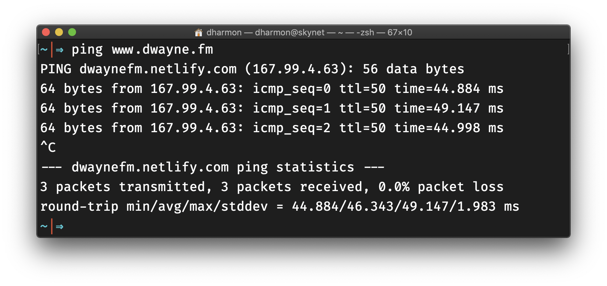
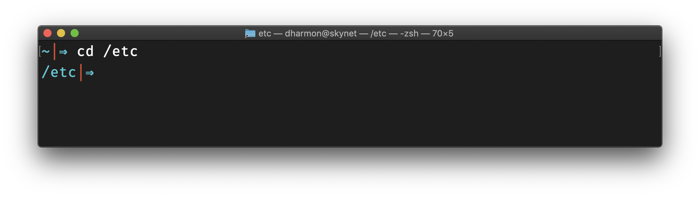
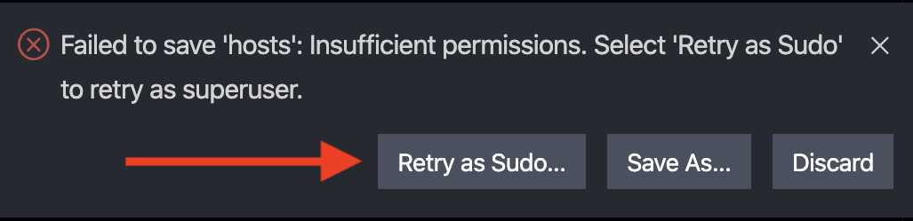
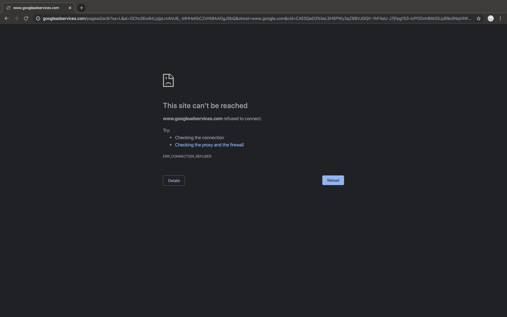

Howdy neighbor🤠! As much as I'd like to dissect the title I don't have it in me to get into that today lol.  Instead I'd like to turn your attention to one way to handle some other symptoms of the times we live in.

### TL;DR
You can edit a hosts file on your computer to override default DNS information. Helpful in a few ways. For example you can use the hosts file to block (or work around) spyware and ad networks by "zeroing out" their IP addresses. 

### Backstory
So there I was nerding out with a good friend of mine, [Mart](https://github.com/MartMcMahon). He mentioned he altered his hosts files to zero out Facebook. So I naturally I stared blankly at him, to which he  delicately responded with an eloquent explanation on what a hosts file is and how they work. 

Please allow me to try my hand at explaining (read: butchering) what a hosts file is. To do this properly, I will need to first explain the DNS.

### Domain Name System

>Domain Name System The Internet's system for converting alphabetic names into numeric IP addresses. For example, when a Web address (URL) is typed into a browser, DNS servers return the IP address of the Web server associated with that name. In this made-up example, the DNS converts the URL www.company.com into the IP address 204.0.8.51. Without DNS, you would have to type the series of four numbers and dots into your browser to retrieve the website, which you actually can do. (Think online yellowpages... but like ipaddresses and urls instead of phone numbers and addresses) [^1]

So, for example, www.dwayne.fm actually translates to 104.248.60.43; www.duckduckgo.com translates to 184.72.104.138. <mark>You can the find the ip address of any website by running </mark> &nbsp; `ping www.name_of_website_.domain` &nbsp; <mark>via command line.</mark> (e.g. `ping www.dwayne.fm`)



### Hosts Files
As mentioned previously, the Domain Name System and its associated cache is your Mac's standard way of knowing how to get to where it's going on the Internet. That said the hosts file can be used to override the default DNS information. [^2] Almost like having your personal address book for your computer, that supercedes the address book of the World Wild Web.

### Configure your Hosts File

Let's get the the point, let's edit your hosts file! First things first, lets locate and open your hosts file. Open your terminal and cd into you root directory (which is not to be confused with your home directory!) 

#### Step 1: Locate Your Hosts File
Run &nbsp;  `cd /etc` &nbsp; in your terminal. This will _change directory_ to the etc directory. _(The etc directory lives in the root directory of your computer. ... Not to be confused with your home directory)_




From the etc directory, you can type &nbsp; `ls` &nbsp; to list the contents. If you do list the items, you will see hosts somewhere in there. Let's open that file in your favorite text editor. These days my text editor is vscode.

#### Step 2: Open Hosts File in Your Text Editor
Run: &nbsp; `code hosts` &nbsp; to open your hosts file in vscode.

#### Step 3: Edit Your Hosts File
Your hosts file should look similar to this:

```
##
# Host Database
#
# localhost is used to configure the loopback interface
# when the system is booting.  Do not change this entry.
##
127.0.0.1localhost
255.255.255.255broadcasthost
::1             localhost

```

Let's zero out Facebook, meaning lets set facebook's ip address to 0.0.0.0. On the last line of the hosts file, add `0.0.0.0 facebook.com` It would look similar to this:

```
##
# Host Database
#
# localhost is used to configure the loopback interface
# when the system is booting.  Do not change this entry.
##
127.0.0.1localhost
255.255.255.255broadcasthost
::1             localhost

0.0.0.0 facebook.com
```

Upon saving your changes, you will be prompted with "Failed to save 'hosts': Insufficient permissions. Select 'Retry as Sudo' to retry as superuser." Follow VSCodes' advice and Retry as Sudo.
<br>




Now, if you restart your browser and try to visit facebook.com, your browser will respond with something along the lines of...




You did it! You've zeroed out facebook! Visiting https://facebook.com will rerout to an ip address of 0.0.0.0. #winning! &nbsp; BUT, why stop here? Why not zero out malware and adware, or gambling sites etc? &nbsp; Enter Steven Black's hosts lists. In my travels down this rabbit hole, I stumbled upon Steven Black's hosts list -- a curated list of various sites to zero out, from adware to gambling, he's got it all covered. 

<br>


Head to [this link](https://raw.githubusercontent.com/StevenBlack/hosts/master/hosts) and copy everything. Then, head back to your hosts file and replace the contents of your hosts file with the copied information from Steven Black's hosts file. &nbsp; Voila! You've now zeroed out a comprehensive list of known adware and malware sites, which makes your internet browsing much safer.

If you would like to take it a step further, do visit [Steven Black's list of hosts files](https://libraries.io/github/StevenBlack/hosts) for more examples of hosts file configuration. Until next time, happy browsing! 


[^1]:[What is DNS?](https://www.pcmag.com/encyclopedia/term/41620/dns)
[^2]:[What is a hosts file?](https://www.imore.com/how-edit-your-macs-hosts-file-and-why-you-would-want)