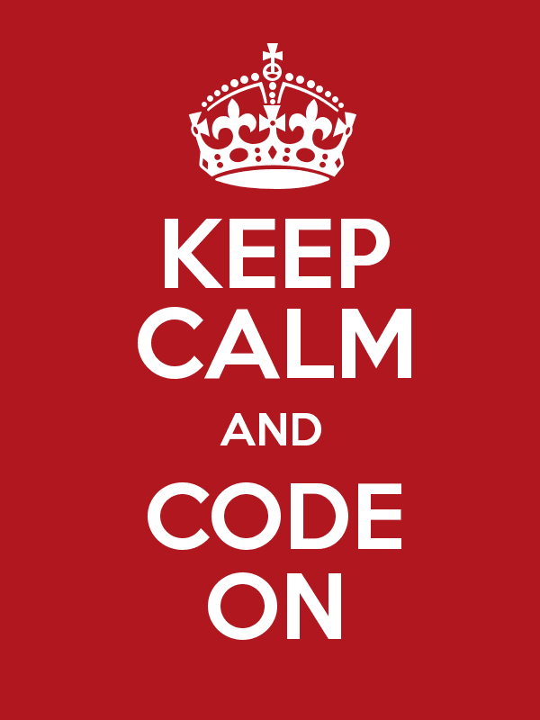

 

For me, programming began at approx. 12 years old. My family bought a new Windows based PC which was cool in of itself. In an afterschool program I discovered Apple computers. I didn't know a lot about Microsoft or Apple, I just knew the computers in the afterschool program had games and other fun things. I wanted those things, at home. Long story short, after interrogating every adult that seemed to know anything about computers, I set out to partition the hard drive on the home computer install OS X. I broke it, I broke everything. I got in a lot of trouble. If I could go back and retry, I would have broken everything again  but  I would have tried everything I wanted to try! (go hard or go home, amirite?) 

I have always been fascinated with all aspects of tech . I mean, how can we not be fascinated with tech!? It has literally infiltrated every aspect of our daily lives. You don’t have to love it, per se. But to never stop and think, “Gee I wonder how a text message works” is bizarre, in my opinion. From reprogramming my RC toy cars, to restyling my MySpace profile pages, I’ve loved it all.

 . &nbsp;  . &nbsp; . 

 

Now just because I love me some technology doesn’t mean I was ready for where [Flatiron](flatironschool.com) was taking me. They started with a nice little gateway drug named Ruby, you may have heard of her. I am still fond of her actually. She’s syntactically sweet and just all around really fun to work with. Next thing I know, I am shivering in a dark alley looking for more. More as in anything related to programming that I could get my hands on. I was (read: am) addicted — with no intention on kicking the habit.

Programming was, and still is very hard, to say the least; programming was, and still is extremely rewarding, to say the least. Avi Flombaum (CoFounder and Dean of Students at The Flatiron School) often says, “My race, my pace”. He uses it as a reminder to not compare yourself to programmers around you. He uses it as a reminder to keep working towards the finish line at your own pace… so long as you keep working. I am sure he uses the phrase for many other reasons, but they resonate with me specifically in those two ways. 

 When the going got tough, when I started to feel burnt out with everything I was learning, I looked for different ways to keep myself engaged. For example, I resolved to pushing one git commit a day to github. That small simple resolution kept me going with a pace I was able to sustain, and eventually turn up when I found the bandwidth. In other words, I found a way to set a pace I could manage. 

Taking it a step further: There came a point where the Rails section of the Flatiron School curriculum was kicking. my. butt. So I took a break from it all, and decided to go build a Rails app incorporating what I had learned thus far. Now, I personally learn in a specific manner. Things gel a little harder / cement quicker when I am able to put them in context. So while Flatiron was taking the time to teach the intricacies of specific and abstract concepts, I was getting frustrated with not knowing how said concepts applied to the real world. I took a a break from Flatiron and followed a couple of code-alongs I found on the interwebs which basically landed me with my very first (and super simple) Rails app! &nbsp; In any event, when I returned to the Flatiron curriculum, I returned like a B O S S!!! That ‘break’ for perspective was exactly what I needed. I was sooo comfortable with Rails moving forward. Had I mastered Rails? No way, not by a long shot! But I understood it completely differently, and was a better programmer because of it.

 . &nbsp;  . &nbsp; . 

 

Which brings me to my point: In the past when feeling defeated by programming, I would close my laptop and not return to it for days, sometimes weeks at a time. It wasn’t an intentional strategy on my part. In retrospect I believe I was experiencing a great deal of trauma with not understanding certain concepts and just feeling stuck. So I started to associate pain with my laptop (clearly I was too stubborn to reach out for help!). In present day, I’ve learned to embrace that “pain” as it’s usually temporary. In present day I have learned to take a step back from what is blocking me; close my laptop, go for a 15 minute walk and return to read or write about what I am struggling with. Even if I am only writing for myself, its good to get thoughts down. I take breaks from programming to pseudo-code, and that helps a great deal! I take breaks from programming and read blog posts about programming. I take breaks from programming to go learn something new (unrelated to whatever I am working on at that moment) that I have been meaning to check out. I even take breaks to go help a Flatiron students or friends out with anything they are stuck on. Even if I don’t necessarily know how to help, it gives us a chance to learn together! (easily one of my favorites!)

 There is so much to do, so much to learn that completely stopping is the one of the most counterproductive things anyone can do for themselves. Get creative with *how* you move forward with your journey. The future you waiting at the finish line will thank you for it, I promise.