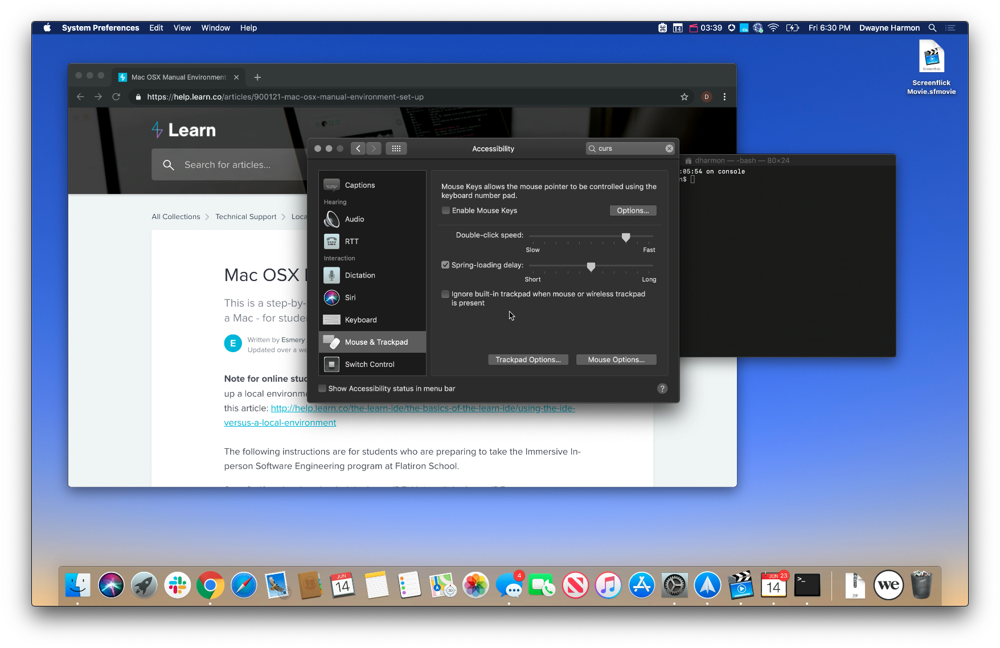
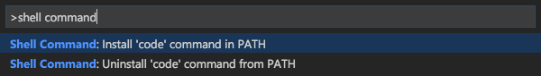

Hello neighbor. This is a simply a port from the [Mac OSX Manual Environment Set Up](https://help.learn.co/en/articles/900121-mac-osx-manual-environment-set-up) on the [Flatiron Learn helpdocs](https://help.learn.co/en/). I ported this manual because I can control the syntax highlighting making it a bit more legible for users.  Sidenote: This is the installation for a Bash shell, as opposed to a Zsh shell. Seeing as how Macs will run Zsh as a default starting with macOS Catalina 10.15, I will post another entry similar to this one with an installation for Zsh. &nbsp; As always, feedback is welcomed!

[](https://youtu.be/Ldj8W6JfJhA)

The video above and the guide below are a step by step guide for how to set up your local environment on a Mac. Note for online students: We do not provide support for environment issues if you set up a local environment using a Mac. For supported environment options, please read this article: http://help.learn.co/the-learn-ide/the-basics-of-the-learn-ide/using-the-ide-versus-a-local-environment
<br>
<br>

### Step 0: Uninstall the learn IDE
If you've downloaded the Learn IDE, uninstall the Learn IDE. For detailed instructions on how to properly uninstall the IDE, please read this [Help Center article](https://help.learn.co/en/articles/492921-deleting-the-ide).
<br>
<hr>

### Step 1: Download Command Line Tools
Open up your Terminal. This is where we are going to be doing most of our installation steps! On Mac, you can open up your terminal by going to Applications > Utilities > Terminal, or by using the quick launch (cmd + space) and just start typing “Terminal”.

In terminal, type &nbsp; `xcode-select --install` &nbsp;If you get a message that the command line tools are already installed, that is fine.
<br>
<hr>

### Step 2: Install Homebrew
Install the Homebrew package manager. You can do this by entering the following command into your terminal:
```bash{outputLines: 1}
ruby -e "$(curl -fsSL https://raw.githubusercontent.com/Homebrew/install/master/install)"
```
Note, this is all one line in the terminal (even if it is broken up into two lines here in your browser).
<br>
<hr>

### Step 3: Install Git
Make sure you have git. It generally comes pre-installed with most operating systems, but you can check by running &nbsp; `git version ` &nbsp;  in terminal. If this gives you an error or does not come back with version number, you'll need to install git. you can get it by typing <span style="color: red;"> brew install git </span> on your terminal.

Run &nbsp; `ssh-keygen` &nbsp; to create a new SSH key. If you do not already have an SSH key set up, you’ll be asked to select a location and a passphrase. Just leave everything blank and press enter for default location and no passphrase. If you’re asked if you want to overwrite, then you already have an SSH key and you do not want to overwrite it.

Next run &nbsp; `cat ~/.ssh/id_rsa.pub` &nbsp; This will display your SSH key to your terminal. You want to then copy this and add this SSH key to your github by following the [instructions posted on GitHub](https://help.github.com/en/github/authenticating-to-github/adding-a-new-ssh-key-to-your-github-account).
<br>
<hr>

### Step 4: Configure git
You need to let git know who you are. You can do this by running the following commands: 

First run:<br/>
`​git config --global user.email "you@example.com"`

Then run:<br/>
`​git config --global user.name "Your Name"​` &nbsp; 

Git will use this email and name as the author for all the changes you make.
<br>
<hr>

### Step 5: Support Libraries
Next we’re going to add a few support libraries with the following lines: <br> &nbsp; `brew install gmp` &nbsp;  and &nbsp; `brew install gnupg` &nbsp; 

Note: If you get the following error: Warning: gnupg-1.4.19 already installed, it's just not linked, run: &nbsp; `brew link gnupg` &nbsp; .
<br>
<hr>

### Step 6: Install Ruby Version Manager
RVM is a tool that lets you run different versions of Ruby on your computer. If one project you're working on works with Ruby version 2.3.3 and another needs 2.6.1, you can easily switch between the two versions when you switch between projects. You can install rvm  and set it up with the following commands:

Run: &nbsp; `curl -sSL https://get.rvm.io | bash` <br/>
(Please make sure you do not use sudo)


Run: &nbsp; ` source ~/.bash_profile ` &nbsp; <br/>
This reloads your terminal configuration file - similar to  closing your terminal and opening it again.

Run: &nbsp; ` rvm install 2.6.1 ` <br/>
This installs Ruby version 2.6.1

Run: &nbsp; `rvm use 2.6.1 --default​` <br/>

Check that everything worked by running &nbsp; ` ruby -v ` &nbsp; This should output the version of ruby you’re using (2.6.1). If you want to see the list of versions that rvm has installed, you can run rvm list.
<br>
<hr>

### Step 7: Install Some Ruby Gems
Ruby gems are pre-written, stand-alone, chunks of code that have been made easily accessible to you.

First, let's update our system gems with: &nbsp; `gem update --system​`

Install the Learn gems. Do this with: &nbsp; `gem install learn-co`

Install the bundler gem. This gem takes care of installing other gems you need for projects: &nbsp; `gem install bundler`

Install nokogiri with: &nbsp; `gem install nokogiri` &nbsp; <br/>
Nokogiri is a gem to help parse HTML - useful when we want to scrape websites. If you encounter any errors while installing it, check out the Nokogiri support docs for Mac OSX. If after following the guide on that page, you still have issues, use the 'Ask a Question' feature to contact support for help.
<br>
<hr>

### Step 8: Set Up the Learn gem 
Now we need to setup the Learn gem. Type the following into your terminal: &nbsp; `learn whoami​` &nbsp; This will prompt you to set up the Learn gem.

Note: When the gem asks you to go to learn.co/your-github-username , you must fill your username into the URL and be logged in to be able to retrieve your token.
<br>
<hr>

###  Step 9: Get a Text Editor
Get a Text Editor. We suggest [Visual Studio Code](https://go.microsoft.com/fwlink/?LinkID=620882); follow the link to download the macOS version.

After downloading and unzipping, make sure to move the Visual Studio Code app from your Downloads folder to your Applications folder. Open finder and navigate to Downloads (or wherever you save downloads). If you see Visual Studio Code there, make sure to drag it over to Applications. 

Once Visual Studio Code is in your Applications  folder, launch the program and type &nbsp; `⇧ (shift)` + `⌘ (command)` + `P` . Your Command Palette will open. 
In your Command Palette type &nbsp;  `>shell command` &nbsp;
​
Select "Shell Command: Install 'code' command in PATH".




Next, let's install Visual Studio Code as your default text editor in the learn-config file. First, open the config file for Learn in a text editor (Let's give Visual Studio Code a try!). If you successfully installed Visual Studio Code and its shell commands, type  &nbsp; `code ~/.learn-config` &nbsp; in your terminal. Your .learn-config file should open in VSCode!

Change default editor from ~~:editor: subl~~ to &nbsp; `:editor: code` &nbsp;  If you have a different editor you prefer, you can set it as the default learn editor in this file. Your file should look like this:

```
---
:learn_directory: "/Users/dharmon/Development/code"
:editor: code
```

You can also set the default location where Learn will save all your labs. By default, the learn_directory is set to  ~/Development/code. 

Save and close the  ~/.learn-config file.

Note: These settings only trigger when you use the 'Open' button in Learn or when you use the learn open command. You can always manually clone your labs to any location you wish and open them with any text editor without having to edit this config file.
<br>
<hr>

### Step 10: Install SQLite and Postgres
You’ll be using a couple of different databases as you move through the web development track. The default database that rails uses is SQLite. We also frequently see that students want to deploy their apps to the free hosting service Heroku. To do this though, you’ll need to be using Postgres instead. It’s best if we just install both of them now so you can use either one.

SQLite: &nbsp; `brew install sqlite` <br/>​
Postgres: Install the Postgres app at: Postgres.app
<br>
<hr>

### Step 11: Install Rails
Finally, rails! The powerful ruby web framework. We can install it with: <br/>
&nbsp; `gem install rails`
<br>
<hr>

### Step 12: Node
Later on in the program, we'll want to run javascript just like we run ruby. On the command line, the program that runs javascript files (the 'Javascript Runtime') is called Node. 

To manage different versions of node installed on our computer, we can use javascript's equivalent of rvm - nvm. Let's get your node version manager installed. 

Make sure you *_do not use sudo_*. &nbsp; Run:

```bash 
curl -o- https://raw.githubusercontent.com/creationix/nvm/v0.33.2/install.sh | bash
```

Run:
```bash
echo 'export NVM_DIR="$HOME/.nvm"' >> ~/.bash_profile
```

Run:
```bash
 echo '[ -s "$NVM_DIR/nvm.sh" ] && . "$NVM_DIR/nvm.sh"' >> ~/.bash_profile
```

Run:
```bash
source ~/.bash_profile
```

This will refresh your shell after making these changes. This way you wont have to quit terminal and open it again.


Finally, run : <br/>
`nvm install node` <br/>
`nvm use node` <br/>
`nvm alias default node` <br/>


to get the latest version of node, switch to using it, and set it as the default.
<br>
<hr>

### Step 13: Dotfiles (Optional)
Configuration files are often prefixed with the '.' character, hiding them from normal file explorer views - hence 'dotfiles'. Since the default configuration of many of the tools we use is somewhat plain, it's helpful to add some configuration on top.

These recommended dotfiles set up a variety of convenient and ergonomic features to some of the most common tools you'll use - irb , git , and bash. 

Note: If when you’re trying to back up a file, you get the error No such file or directory , don’t worry. This just means you didn’t have that file to start with, so there is nothing to back up.


Back up your .irbrc file with: &nbsp; `mv ~/.irbrc{,.bak}` <br/>
Then run
```bash
curl "https://raw.githubusercontent.com/flatiron-school/dotfiles/master/irbrc" -o "$HOME/.irbrc"
```  
<br/>This file gives you some nice formatting for when you’re in IRB (IRB lets you write ruby code in your terminal)

Back up your .gitignore file with &nbsp; `mv ~/.gitignore{,.bak}`
Then run:
```bash
​curl "https://raw.githubusercontent.com/flatiron-school/dotfiles/master/ubuntu-gitignore" -o "$HOME/.gitignore"
```
These are global .gitignore rules. When you add a .gitignore file to a project, it let’s you specify certain files that you DO NOT want pushed up to github (like API keys…)

Back up your .bash\_profile file with  &nbsp; ` mv ~/.bash_profile{,.bak} `  <br/>
Then run:
```bash
​curl "https://raw.githubusercontent.com/flatiron-school/dotfiles/master/bash_profile" -o "$HOME/.bash_profile"
```
Your bash profile loads up every time you open a terminal window. The Learn bash_profile is designed to load up a bunch of shortcuts for you as well as make sure that RVM loads up every time you open the terminal. I recommend you take a look at this file and even see if there are any shortcuts of your own that you’d like to add! Note: this will overwrite existing bash profile, so back up if you want to.

Back up your .gitconfig file with  &nbsp; `mv ~/.gitconfig{,.bak}` <br/>
Then run:
```bash
​curl "https://raw.githubusercontent.com/flatiron-school/dotfiles/master/gitconfig" -o "$HOME/.gitconfig"
```
From your home directory in your terminal, if you head to &nbsp; `code ~/.gitconfig` &nbsp; (you can access this file with the editor of your choosing) and edit what needs to be edited (github username and github email in a few places).