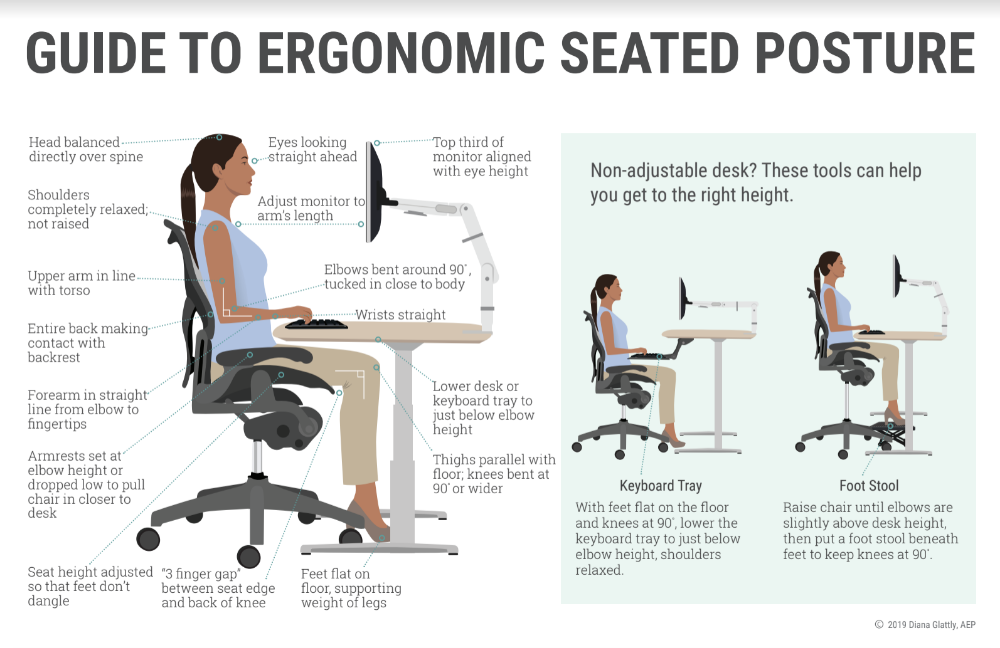

Hai friend! Mental health is such a broad topic, I wasn't sure where to begin or how deep I should go. I've decided to at least reflect on behaviors that I believe every developer should strive for -- while leaving plenty of room for you to tailor your experience to your preferences.

## Mental Health

I found [this article](https://codinginflow.com/healthy-programmer) to be somewhat helpful, in that it summarized trends I've noticed in tech spaces over the years. More importantly I'd like to speak to examples of how some of these habits have helped me directly. Let's dive in, in no particular order: 

 . &nbsp;  . &nbsp; . 

### Take Regular Breaks

Let's think of your brain as a muscle. With that in mind let's compare it to another muscle (or group of muscles), say your legs. How many times can you run a 100 meter dash, at maximum effort, consecutively? If we are being honest, the answer is probably 1 (at maximum effort). You *MIGHT* be able to run one sprint before you need a break and can try again. Sidenote: I don't know that I can actually sprint 100 meters right now if I am going to be completely honest, but whatevs.  <talk about what sprinting fatigue looks like here>

So for staying on top of breaks between coding intervals at maxiumum effort, the [Pomodoro Technique](https://en.wikipedia.org/wiki/Pomodoro_Technique) has helped out a lot. Taking it a step further, the macOS app [Be Focused Pro](https://itunes.apple.com/us/app/be-focused-pro-focus-timer/id961632517?mt=12) has been really really helpful in automating breaks. 

Simply put, your brain needs air; your brain needs rest just like anything else in your body. &nbsp; E S P E C I A L L Y &nbsp; when you have been working very hard. When you deny your brain rest, it doesn't show in the same ways it would show in other work outs. You dont sweat, or pant. You miss commas, typos creep in to your work, you cant detect spelling errors as quickly etc. The brain works in mysterious ways.

 

### Get Some Exercise

I purposefully put this one second after mentioning taking regular breaks. If you are using the Pomodoro Technique, you get a longer break after a few short breaks (That'll make more sense after you looked into the technique itself.) Anywho, when you land on a longer break cycle, try doing some light exercises to get the blood flowing. Situps, a brisk walk, stairs, something, anything.

A common misconception I despise is that you need a gym membership to be healthy. Not true. We aren't training for the Olympics here, we are just talking about getting blood circulating so that it inevitably reaches your brain. 

Ill leave it up to you to choose what exercise you do, just please don't stress yourself out over it.

 

### Eat Properly

Simply put, your body is a machine. Let's say that machine is a Ferrari. Would you put just any gas into your (vintage?) Ferrari? I should hope not. Same thing applies to your body - Be good to it. I keep fun things around to snack on through out the day. When I am being the best version of myself, that can be trail mix, nuts, granola bars, yogurt anything. BUT keep in mind, sometimes you just want candy / sugar. Its fine to have that around as well. Try to have a net positive on the snacks you keep around. 80% healthy snacks that you actually like, and 20% junk food snacks that you love but know better than to sit around and eat all day every day. 

 

### Fix Your Posture 

Check out [the article linked above](https://codinginflow.com/healthy-programmer), [this article](https://blog.codinghorror.com/computer-workstation-ergonomics/), or the graphic below on ergonomics at your work station. Simply put, you spend 40+ hours a week seated in, and stationary while programming. It is of the utmost importance that you are setting your body up for success in _how_ you position yourself at your desk.

I do have one recommendation that I feel very strongly about, and thats the [Varier Balans Chair](https://www.amazon.com/Varier-Variable-Original-Kneeling-Designed/dp/B071ZM1CKG/ref=sr_1_5?keywords=balans+chair&qid=1580888488&sr=8-5). Ive used it in various office spaces, but haven't made the investment myself... yet.  My birthday is July 17th, if you're feeling froggy 🐸🙃

 

### Sleep

lmao whats a sleep? I am the worst at sleeping habits so I wont try to preach to you on this. I can just tell you have seen monumental gains in productivity when I get enough rest. That said, I have been pretty good about teaching myself to get adequate rest (I am a night owl AND an early bird. I know). However, I haven't been good about going to bed at the same time every night. 

I  &nbsp; l o v e  &nbsp; [this article](https://simpleprogrammer.com/good-nights-rest/) on healthy sleep habits. Be sure to check it out and let me know what you think!

 . &nbsp;  . &nbsp; . 

 

In conclusion, as devs, while you are learning to hack applications, learn how to hack yourselves as well. Making minor adjustments and running some tests to verify change ought to yield interesting results in your programming performance. Find ways to be better to yourself, your body will thank you for it♥️